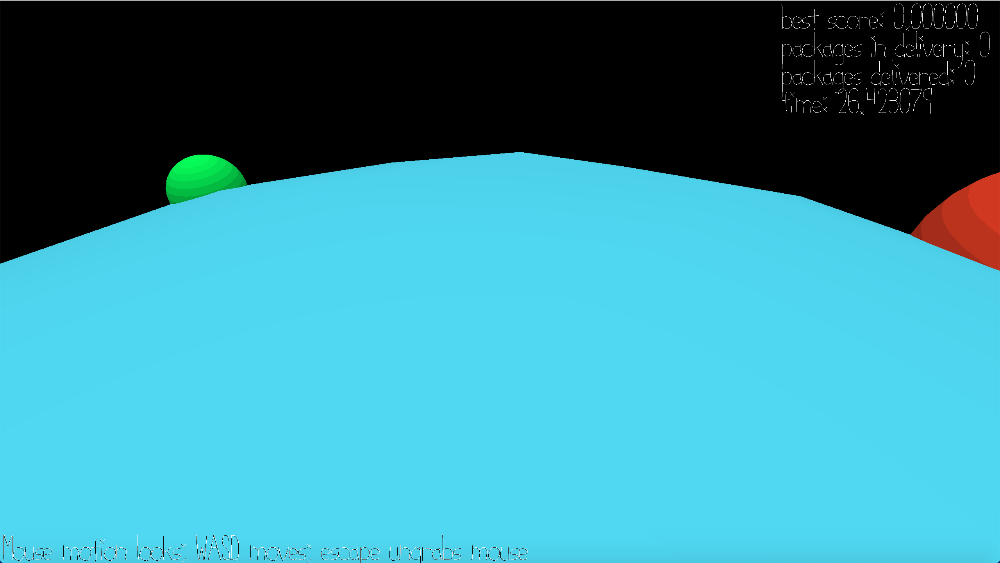

# Planet Delivery Man

Author: Jianrong Yu

Design: You are a delivery man in a strange new planet. You deliver the packages from each base on the bright side of the planet to the dark side of the planet.

Screen Shot:

How To Play:

Use WASD to move, SPACE to pick up the package when you are in the base. Walk to the dark side of the planet to deliver the package. 
You must deliver the package in the order that the packages are picked up!! If you wish you can deliver each package one by one, though that would be really slow. The game will record your fastest time to complete all the delivery.
The dark side has no color so the trick is to memorize the size of the bases.

Sources: All assets are my own.

This game was built with [NEST](NEST.md).

